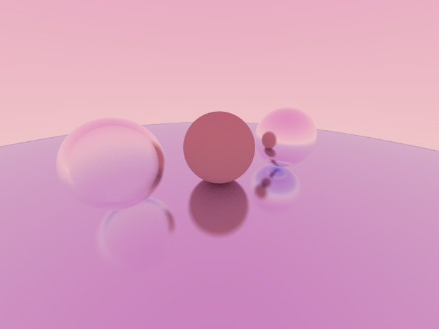

# Ray Tracing
Simple raytracing program, the same you'we seen hundred times.
But with modern C++23.

## Result


## Download

This project uses git submodules, consider using `--recursive` flag when cloning.

```
git clone --recursive https://github.com/Miolith/raytracing.git
```

## Build
```
mkdir build
cd build
cmake ..
make
```